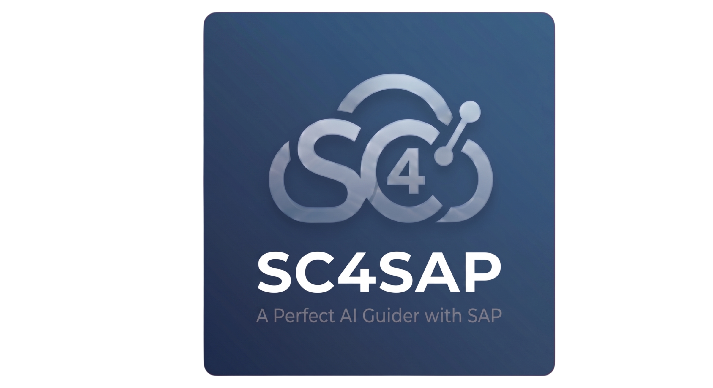

<p align="center">
  
</p>

<p align="center">
  English | <a href="README.ko.md">한국어</a> | <a href="README.ja.md">日本語</a> | <a href="README.de.md">Deutsch</a> | <a href="README.zh.md">中文</a>
</p>

# SuperPlugin for SAP (sp4sap)

> SAP ABAP development for **Claude Code, ZCode, Codex** and any MCP client — SAP ECC / S/4HANA On-Premise / S/4HANA Cloud (Public & Private)

[](https://www.npmjs.com/package/@babamba2/abap-mcp-adt-powerup)
[](https://www.npmjs.com/package/@shaohengxui/superplugin-for-sap)
[](https://github.com/ShaohengXui/superplugin-for-sap)
[](LICENSE)

## What is sp4sap?

SuperPlugin for SAP transforms your coding agent into a full-stack SAP development assistant. It connects to your SAP system via the [MCP ABAP ADT server](https://github.com/babamba2/abap-mcp-adt-powerup) (150+ tools) to create, read, update, and delete ABAP objects directly — classes, function modules, reports, CDS views, Dynpro, GUI status, and more.

The SAP capability lives in the MCP server, so **the same install serves every client**. Claude Code additionally gets the skill/agent orchestration layer (25 specialized agents, 14 workflow skills, per-phase model routing); ZCode and Codex get the same tools and can drive them from prompts.

## Quick Start

### 1. Install

**Claude Code** — add this repository as a custom marketplace, then install the plugin:

```
/plugin marketplace add https://github.com/ShaohengXui/superplugin-for-sap.git
/plugin install sp4sap
```

**ZCode, Codex, or any other MCP client** — one command detects what is installed and registers sp4sap with each client:

```bash
git clone https://github.com/ShaohengXui/superplugin-for-sap.git
cd superplugin-for-sap
npm install

node bridge/cli.cjs install              # every client detected on this machine
node bridge/cli.cjs install --dry-run    # preview first — changes nothing
```

Or target one client explicitly:

```bash
node bridge/cli.cjs install --client codex    # codex plugin + MCP, else codex mcp add
node bridge/cli.cjs install --client zcode    # writes <repo>/.zcode/config.json
node bridge/cli.cjs install --client claude   # claude plugin, else claude mcp add -s user
node bridge/cli.cjs install --mcp-only        # skip the skills/agents plugin
```

After `npm i -g @shaohengxui/superplugin-for-sap` the same commands are available as `sp4sap install`. Use `sp4sap status` to see what is registered where, and `sp4sap uninstall` to remove it.

> **Check the installed version.** The `sp4sap` CLI ships from **0.7.0** onward. If `sp4sap --version` reports an older release, the published npm package predates the installer — use the clone-and-`node bridge/cli.cjs` path above instead, or install the CLI from the checkout with `npm i -g .`.

> **ZCode** reads the Claude Code plugin layout, so this repository also works as a ZCode plugin: **Settings → Plugin Management → Discover → `+`** and add the checkout path (or the Git URL). Skip `--client zcode` if you install it that way — otherwise the same tools are registered twice.

### 2. Connect to SAP

```
/sp4sap:setup
```

The wizard creates a profile, stores the password in the **OS keychain**, installs and builds the MCP server, installs the write-protection hooks, and runs the connection test. Nothing sensitive is written into your repository.

Already have a profile, or using a non-Claude client? Point the server at it explicitly:

```bash
sp4sap doctor          # shows the resolved profile, vendor pin, and active tier
```

### 3. Verify

```
/sp4sap:sap-doctor
```

Or just ask the agent to call `GetSession` — it returns the SAP system ID, client and user.

> **Requirements** — Node.js ≥ 20, an SAP system with ADT enabled (SICF service `/sap/bc/adt` active), and a user with `S_DEVELOP` / `S_TRANSPRT`.

## Usage

### Claude Code — workflow skills

```
/sp4sap:create-program    Create an ALV report for open purchase orders by vendor,
                          with filtering by plant and purchasing org
/sp4sap:create-object     Create a custom class / FM / CDS view
/sp4sap:analyze-code      Static review: Clean ABAP, performance, security
/sp4sap:analyze-symptom   Triage a dump or incident to a root cause
/sp4sap:program-to-spec   Reverse-engineer an object into a functional/technical spec
/sp4sap:compare-programs  Compare 2–5 programs that share a scenario
/sp4sap:package-to-process  Turn a CBO package into an end-to-end process document
/sp4sap:ask-consultant    Ask a module consultant (SD/MM/FI/CO/PP/PS/PM/QM/TR/HCM/WM/TM/BW/Ariba/BC)
/sp4sap:sap-option        Switch profile, adjust blocklist policy, HUD settings
```

You can also just describe the task in plain language — the skills trigger on keywords.

### Any MCP client — the same tools

Without the plugin layer there are no slash commands, but every tool is available; ask in natural language and the client picks the tool. Common tasks:

| Goal | Tools involved |
|------|----------------|
| Verify the connection | `GetSession` |
| Read an object | `GetClass`, `ReadClass`, `GetProgram`, `ReadProgram`, `GetFunctionModule` |
| Find objects | `SearchObject`, `GetPackageContents`, `GetWhereUsed` |
| Create / change an object | `Create*` → `Update*` → `ActivateObjects` |
| Test it | `RunUnitTest`, `GetUnitTestResult`, `GetAbapSemanticAnalysis` |
| Transports | `ListTransports`, `GetTransport`, `CreateTransport` |
| Diagnose | `RuntimeListDumps`, `RuntimeGetDumpById`, `RuntimeAnalyzeDump` |

Example prompts that work in any client:

```
Read ABAP class ZCL_SD_ORDER_VALIDATOR and summarize what it does.
Create an ALV report for open purchase orders by vendor, with plant filtering.
Review Z_MM_PURCHASE_ORDER_CREATE for Clean ABAP violations and performance issues.
List the open transport requests for my user and summarize what is in them.
```

### Write protection on QA and Prod

Registering a QA or Prod profile is enough — no opt-in. Three independent layers enforce it, so a client that bypasses one is still covered by the others:

| Layer | Where | Applies to |
|-------|-------|-----------|
| **L1** | client `PreToolUse` hook (`scripts/hooks/tier-readonly-guard.mjs`), installed by `/sp4sap:setup` | Claude Code |
| **L1.5** | MCP proxy in the bridge (`SC4SAP_TIER_GUARD=proxy`) | any stdio client — on by default for Codex/ZCode, whose hook coverage is not assumed |
| **L2** | inside `abap-mcp-adt-powerup`, uncircumventable | every client, always |

On QA and Prod, mutations (`Create*` / `Update*` / `Delete*` / `Patch*` / `Write*` / `Activate*`) and ABAP execution (`RunUnitTest` on Prod, `RuntimeRun*`) are rejected. `RunUnitTest` stays available on QA. Diagnostics that only read dumps and traces stay available on both.

Switch environments in-session with `/sp4sap:sap-option` (Claude Code) or by pointing `SC4SAP_ENV_FILE` at another profile's `sap.env`.

## Core Capabilities

| Capability | What it does |
|------------|--------------|
| 🔌 **Auto MCP Install** | `abap-mcp-adt-powerup` is auto-installed, configured, and connection-tested during `/sp4sap:setup`. No manual MCP wiring. |
| 🌐 **Multi-Environment Profiles (Dev / QA / Prod)** | Register multiple SAP systems per company (e.g. `KR-DEV`, `KR-QA`, `KR-PRD`, `US-DEV`) and hot-switch between them in-session via `/sp4sap:sap-option`. **QA and Prod profiles are auto-protected**: a 3-layer defense (client PreToolUse hook + MCP-layer proxy + MCP-server guard) blocks `Create*/Update*/Delete*/Patch*/Write*/Activate*`, `CreateTransport`, and runtime code execution tools — bypassing one layer does not bypass the others. Passwords are stored in the **OS keychain** (`@napi-rs/keyring` — Windows Credential Manager / macOS Keychain / libsecret) so `.sc4sap/` never leaks secrets to git. Artifacts (specs, CBO catalogs, audits) are isolated per profile with read-only cross-view so QA sessions can inspect Dev-produced specs without contaminating them. |
| 🏗️ **Formatted Auto Program Maker** | Builds ABAP programs end-to-end: Main + conditional Includes (OOP/Procedural), full ALV + Docking, Dynpro + GUI Status, mandatory Text Elements, ABAP Unit tests — platform-aware (ECC / S4 On-Prem / Cloud). |
| 🔍 **Program Analyze** | Read any ABAP object via MCP, run Clean ABAP / performance / security review, or reverse-engineer into Functional/Technical Spec (Markdown/Excel). |
| 🧪 **Analyze Code** | `/sp4sap:analyze-code` — dedicated static review pass (`sap-code-reviewer`): Clean ABAP, performance, security, SAP standard compliance. Severity-ranked findings with concrete fix suggestions. |
| 🔀 **Compare Programs** | `/sp4sap:compare-programs` — side-by-side business comparison of 2–5 ABAP programs that share the same scenario but split by module (MM/CO), country (KR/EU), or persona (controller/warehouse). Consultant-facing Markdown report across 10 configurable dimensions. |
| 🗺️ **Package → Process** | `/sp4sap:package-to-process` — reverse-engineer a CBO package into an **end-to-end business-process** document: auto-detected TCode entry points → AI process grouping (PR→PO→GR→IR) → per-process narrative + Mermaid flowchart / sequence diagram + step tables. Auto-chains `sap-stocker` when CBO inventory is missing. → `.sc4sap/processes/<MODULE>/<PACKAGE>/`. |
| 🩺 **Maintenance Diagnosis** | Operational triage loop: ST22 dumps, SM02 system messages, /IWFND/ERROR_LOG, profiler traces, logs, where-used graphs — all from Claude. |
| ♻️ **CBO Reuse (Brownfield Accelerator)** | Inventory a Z-package once — `create-program` / `program-to-spec` prefer reusing existing CBO assets over duplicates. |
| 🧷 **CBO Extension Awareness (CMOD / GGB1·2 / BAdI / APPEND)** | Inventories user-exits (CMOD), substitutions & validations (GGB1/GGB2), BAdI implementations, and APPEND structures. `create-program` / BAPI flows prefer existing Extension fields (e.g. BAPI `EXTENSIONIN` / table appends) over new CBOs; dump & incident diagnosis inspects Extension points as first-class suspects. |
| 🏭 **Industry Context** | 14 industry reference files (retail, fashion, cosmetics, tire, automotive, pharma, F&B, chemical, electronics, construction, steel, utilities, banking, public-sector). |
| 🌏 **Country / Localization** | 15 per-country files + EU-common (KR/JP/CN/US/DE/GB/FR/IT/ES/NL/BR/MX/IN/AU/SG). e-invoicing, banking, payroll, tax localization. |
| 🧩 **Active-Module Awareness** | Cross-module integration hints: MM + PS active → auto-suggest WBS fields on MM CBOs; SD + CO active → CO-PA derivation. [Details →](common/active-modules.md) |
| 🤝 **Module Consultation** | `sap-analyst` / `sap-critic` / `sap-planner` / `sap-architect` delegate to 14 module consultants + 1 BC consultant when business judgement is needed. Users can also ask a module consultant directly via `/sp4sap:ask-consultant` — auto-routes SD/MM/FI/CO/PP/PS/PM/QM/TR/HCM/WM/TM/BW/Ariba/BC by keywords, answers against the configured SAP environment (version, industry, country, active modules), read-only. |
| ⚡ **Per-Phase Model Routing** | Every skill targets a cost-tuned main-thread tier (Haiku for config / diagnostics / Q&A, Sonnet for analyze / create / compare orchestration) while delegating heavy work to specialized agents (Opus for novel ABAP generation, cross-module synthesis, and incident triage; Sonnet for facts extraction; Haiku for report rendering). The main-thread target is declarative — runtime main follows the user's session model; per-phase `Agent()` dispatches DO run on their declared tier. Model choice is visible in every response prefix + per-phase banner (e.g. `▶ phase=3 (writer-spec) · agent=sap-writer · model=Opus 4.7`). Full matrix — per-skill, per-phase — in [docs/skill-model-architecture.md](docs/skill-model-architecture.md). |

## Documentation

- 📦 **[Installation & Setup →](docs/INSTALLATION.md)** — requirements, install options, wizard steps, blocklist configuration
- 🎯 **[Features Deep-Dive →](docs/FEATURES.md)** — 25 agents, 14 skills, MCP tools, RFC backends, hooks, data-extraction policy
- 🔌 **[MCP Client Setup →](mcp/README.md)** — connecting ZCode, Codex, Claude Desktop or any MCP client; config templates; write-guard layering per client
- 🧭 **[Multi-Client Migration →](docs/multi-client-migration.md)** — what is Claude-Code-specific vs MCP-generic, the phased refactor, risks and rollback
- 🧠 **[Skill Model Architecture →](docs/skill-model-architecture.md)** — per-skill / per-phase model allocation (Haiku 4.5 / Sonnet 4.6 / Opus 4.7), model override patterns, escalation ladders, design rationale
- 📜 **[Changelog →](docs/CHANGELOG.md)** — version history and breaking changes

## Unleashed

<p align="center">
  <a href="sp4sap_unleashed.png">
    
  </a>
</p>

## Author

- **paek seunghyun** &nbsp; [](https://www.linkedin.com/in/seunghyun-paek-5b83b7183/)

## Contributors

- **김시훈 (Kim Sihun)** &nbsp; [](https://www.linkedin.com/in/sihun-kim-27737132b/)

## Acknowledgments

This project was inspired by [**oh-my-claudecode**](https://github.com/huryechan/oh-my-claudecode) by **허예찬 (Hur Ye-chan)**. The multi-agent orchestration patterns, Socratic deep-interview gating, persistent loop concepts, and overall plugin philosophy here all trace back to that work.

[**mcp-abap-adt**](https://github.com/fr0ster/mcp-abap-adt) by **fr0ster** was a major contribution to building our customized MCP server (`abap-mcp-adt-powerup`). The pioneering ADT-over-MCP work — request shaping, endpoint coverage, object I/O — provided the conceptual foundation we drew on while designing and extending our own server.

## License

[MIT](LICENSE)
